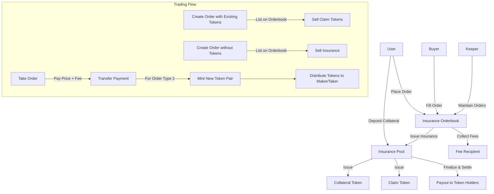
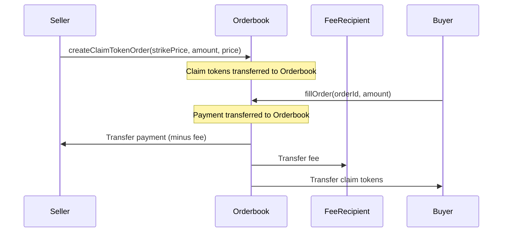
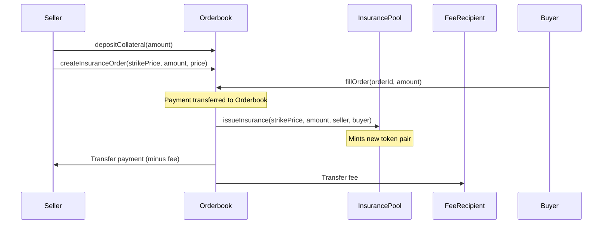
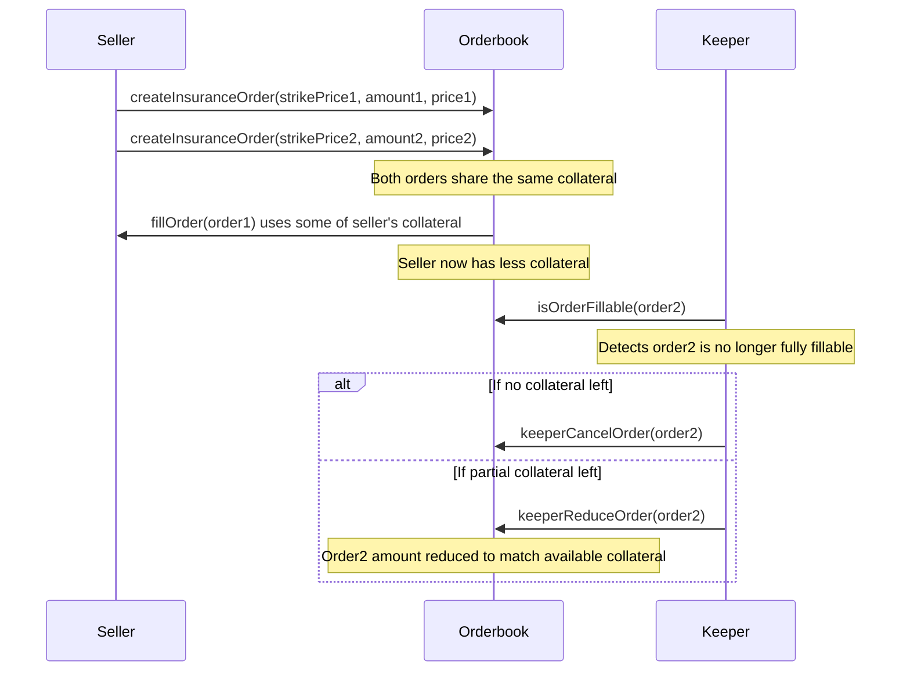
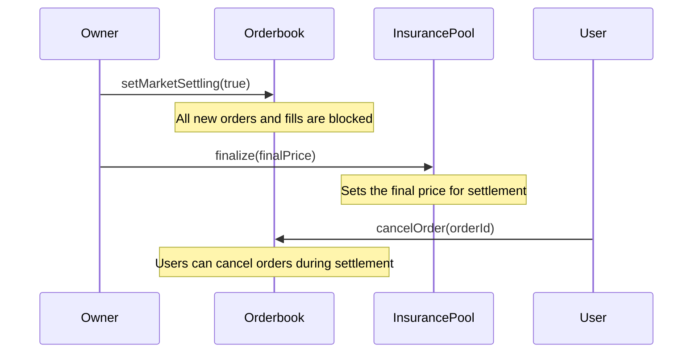

# Price Insurance Protocol Documentation

## Overview

The Price Insurance Protocol is a decentralized financial product that allows users to hedge against price movements of a specific asset. The protocol issues two types of tokens for each strike price:

1. **Collateral Tokens**: Represent the right to claim the collateral if the final price is at or above the strike price.
2. **Claim Tokens**: Represent the right to claim compensation if the final price falls below the strike price.

## Protocol Architecture



## Core Components

### InsurancePool Contract

The `InsurancePool` contract is the main entry point for users to interact with the insurance protocol.

#### Key Features

- **Multiple Strike Prices**: Users can issue insurance at different strike prices.
- **ERC20 Collateral**: Uses an ERC20 token as collateral.
- **Token Pair Creation**: Creates a pair of ERC20 tokens for each strike price (collateral token and claim token).
- **Settlement Mechanism**: After finalization, allows users to claim their appropriate compensation based on the final price.

#### Contract State

- `COLLATERAL_TOKEN`: The ERC20 token used as collateral for the insurance.
- `getInsuranceTokens`: Mapping from strike price to the associated collateral and claim tokens.
- `finalized`: Boolean indicating whether the insurance period has ended.
- `FinalPrice`: The final price used for settlement once the insurance period is finalized.

### InsuranceToken Contract

A specialized ERC20 token that represents either a claim token or a collateral token.

#### Key Features

- **Mintable**: Only the owner (InsurancePool) can mint new tokens.
- **Burnable**: Only the owner can burn tokens during redemption or settlement.

### InsuranceOrderbook Contract

The `InsuranceOrderbook` contract manages limit orders for buying and selling insurance.

#### Key Features

- **Two Order Types**: 
  1. Selling existing claim tokens
  2. Selling insurance (without having tokens yet)
- **Ask-Only System**: Only ask orders (selling) are supported, no bid orders.
- **Collateral Management**: Users can deposit and withdraw collateral for creating orders.
- **Order Execution**: Automatically issues new insurance tokens when necessary.
- **Market Settling Mode**: Prevents new orders from being created or filled during settlement.
- **Transaction Fees**: Collects percentage-based fees on trades and sends them to a designated recipient.
- **Keeper System**: Allows automated maintenance of unfillable orders through a whitelisted keeper address.
- **Capital Efficiency**: Users can create multiple orders with the same collateral, as each order only requires collateral when it's filled.

#### Contract State

- `insurancePool`: Reference to the InsurancePool contract (immutable).
- `collateralToken`: The ERC20 token used as collateral (immutable, derived from InsurancePool).
- `isMarketSettling`: Boolean flag that prevents new orders when true.
- `feeRate`: Fee rate in basis points (1/100 of a percent). Default is 50 (0.5%).
- `feeRecipient`: Address that receives collected fees.
- `keeper`: Whitelisted address authorized to maintain unfillable orders.
- `orders`: Mapping from orderId to Order details.
- `userCollateralBalance`: Tracks user's deposited collateral.
- `nextOrderId`: Counter for generating unique order IDs (starts at 1).

#### Order Structure

```solidity
struct Order {
    address maker;           // Address of the order creator
    uint256 strikePrice;     // Insurance strike price
    uint256 amount;          // Amount of tokens for sale
    uint256 price;           // Price per token (in collateral token)
    bool isClaimTokenOrder;  // true if selling claim tokens, false if selling insurance
}
```

## Insurance Pool Functions

### Issuing Insurance

```solidity
function issueInsurance(
    uint256 strikePrice,
    uint256 amount,
    address collateralTokenRecipient,
    address claimTokenRecipient
) external
```

Issues insurance for a specific strike price:
1. Creates new token pairs if they don't exist for the strike price.
2. Calculates and collects the required collateral based on strike price.
3. Mints and distributes collateral and claim tokens to specified recipients.

### Redeeming Insurance

```solidity
function redeemInsurance(
    uint256 strikePrice,
    uint256 amount
) external returns (uint256 collateralAmount)
```

Allows users to redeem both collateral and claim tokens before finalization:
1. Burns both token types.
2. Returns the corresponding collateral to the user.

### Finalizing Insurance

```solidity
function finalize(uint256 finalPrice) external onlyOwner
```

Ends the insurance period by setting the final price used for settlement.
Only the contract owner can finalize the insurance.

### Settling Insurance

```solidity
function settleInsurance(
    uint256[] calldata strikePrices
) public returns (uint256 amountClaimed)
```

After finalization, allows users to claim their compensation:
1. For collateral tokens: Claim is proportional to the final price.
2. For claim tokens: If final price < strike price, claim the difference.
3. Burns all tokens being settled.
4. Transfers the total claimed amount to the user.

## Orderbook Functions

### Administrative Functions

```solidity
function setFeeRate(uint256 _feeRate) external onlyOwner
function setFeeRecipient(address _feeRecipient) external onlyOwner
function setKeeper(address _keeper) external onlyOwner
```

Functions for the owner to manage the system:
1. `setFeeRate`: Sets the fee percentage (in basis points, max 10%).
2. `setFeeRecipient`: Sets the address that receives collected fees.
3. `setKeeper`: Sets the whitelisted keeper address for order maintenance.

### Market Settling Control

```solidity
function setMarketSettling(bool settlingStatus) external onlyOwner
```

Allows the owner to toggle market settling mode. When enabled, no new orders can be created or filled.

### Depositing and Withdrawing Collateral

```solidity
function depositCollateral(uint256 amount) external
function withdrawCollateral(uint256 amount) external
```

Simple functions for users to deposit and withdraw collateral for creating orders.

### Creating Orders

```solidity
function createClaimTokenOrder(
    uint256 strikePrice, 
    uint256 amount, 
    uint256 price
) external whenNotSettling returns (uint256 orderId)

function createInsuranceOrder(
    uint256 strikePrice, 
    uint256 amount, 
    uint256 price
) external whenNotSettling returns (uint256 orderId)
```

Two methods for creating orders:
1. **createClaimTokenOrder**: For users who already have claim tokens and want to sell them.
2. **createInsuranceOrder**: For users who want to sell insurance without having tokens yet (requires deposited collateral).

Both functions are restricted when the market is in settling mode.

### Managing Orders

```solidity
function cancelOrder(uint256 orderId) external
function keeperCancelOrder(uint256 orderId) external onlyKeeperOrOwner
function keeperReduceOrder(uint256 orderId) external onlyKeeperOrOwner
```

Functions for managing existing orders:
1. `cancelOrder`: Allows users to cancel their own orders, or any order during settlement mode.
2. `keeperCancelOrder`: Allows the keeper to cancel unfillable orders (orders where maker lacks sufficient collateral).
3. `keeperReduceOrder`: Allows the keeper to reduce order amount to match maker's available collateral.

### Order Information

```solidity
function isOrderFillable(uint256 orderId) external view returns (bool)
function getMaxFillableAmount(uint256 orderId) public view returns (uint256)
function getOrder(uint256 orderId) external view returns (address, uint256, uint256, uint256, bool)
function calculateSellerCollateral(uint256 strikePrice, uint256 amount) public pure returns (uint256)
```

Helper functions to check order status and details:
1. `isOrderFillable`: Returns whether an order can be filled given current maker's collateral.
2. `getMaxFillableAmount`: Returns the maximum amount that can be filled based on available collateral.
3. `getOrder`: Returns complete details about a specific order (maker, strikePrice, amount, price, isClaimTokenOrder).
4. `calculateSellerCollateral`: Calculates the collateral needed for a given strike price and amount `(amount * strikePrice / 1e18) + 1`.

### Filling Orders (Taking Asks)

```solidity
function fillOrder(uint256 orderId, uint256 amount) external whenNotSettling
```

Allows users to buy insurance by taking an existing ask order:
1. Calculates total payment and fee amount based on the current fee rate.
2. For claim token orders: 
   - Transfers payment to seller (minus fee).
   - Transfers fee to fee recipient.
   - Transfers claim tokens to the buyer.
3. For insurance orders: 
   - Uses seller's collateral to mint new token pairs.
   - Distributes the claim token to the buyer and the collateral token to the seller.
   - Transfers payment to seller (minus fee).
   - Transfers fee to fee recipient.

This function is restricted when the market is in settling mode.

## Settlement Logic

The settlement logic follows these rules:

1. Collateral token holders receive: `collateralBalance * finalPrice / 1e18`
2. Claim token holders receive additional compensation if `finalPrice < strikePrice`: `claimBalance * (strikePrice - finalPrice) / 1e18`

## Order Execution Flows

### Flow 1: Selling Existing Claim Tokens



### Flow 2: Selling Insurance (Without Tokens)



### Flow 3: Keeper Maintenance for Capital Efficiency



### Flow 4: Market Settlement Process



## Example Scenarios

### Scenario 1: Price Above Strike Price

If a user issues insurance at strike price 20,000, and the final price is 25,000:
- Collateral token holders receive full compensation.
- Claim token holders receive nothing additional.

### Scenario 2: Price Below Strike Price

If a user issues insurance at strike price 20,000, and the final price is 15,000:
- Collateral token holders receive partial compensation (proportional to final price).
- Claim token holders receive the difference between strike price and final price.

### Scenario 3: Fee Collection

When a user fills an order with amount 10 and price 100:
- Total payment: 1000 (10 * 100)
- Fee (with 0.5% rate): 5 (1000 * 0.005)
- Seller receives: 995 (1000 - 5)
- Fee recipient receives: 5

### Scenario 4: Capital Efficiency and Keeper Maintenance

1. Alice deposits 10,000 units of collateral
2. Alice creates two insurance orders:
   - Order 1: Strike price 20,000, amount 0.4 (requires 8,000 collateral)
   - Order 2: Strike price 25,000, amount 0.2 (requires 5,000 collateral)
3. Bob fills 50% of Order 1, using 4,000 of Alice's collateral
4. Alice now has 6,000 collateral left
5. Order 2 can no longer be filled for its full amount (needs 5,000, but collateral is 6,000)
6. The keeper calls `getMaxFillableAmount(order2)` and sees it can only fill for ~0.12 amount
7. The keeper calls `keeperReduceOrder(order2)` to reduce the order to a fillable amount

## Security Considerations

1. **Access Control**: Critical functions like finalization are restricted to the contract owner.
2. **SafeERC20**: Uses OpenZeppelin's SafeERC20 for secure token transfers.
3. **State Transitions**: Uses modifiers to enforce proper sequencing (e.g., cannot settle before finalization).
4. **Collateral Management**: Ensures sellers have sufficient collateral before orders are created or filled.
5. **Market Settling Protection**: Prevents market manipulation during the settlement process.
6. **Fee Limits**: Maximum fee rate is capped at 10% to prevent abuse.
7. **Keeper Restrictions**: Keeper can only cancel or reduce orders that are actually unfillable.
8. **Capital Efficiency**: Users can create multiple orders sharing the same collateral, but keeper system maintains order integrity.
9. **Rounding Considerations**: Collateral calculation includes an additional 1 wei to account for rounding issues.
10. **Order Validity Checks**: Functions verify order existence and availability before execution.
11. **Token Approval Management**: Handles ERC20 approvals for the insurance pool interaction.

## Contract Initialization

The InsuranceOrderbook is initialized with:
- InsurancePool reference (immutable)
- Collateral token derived from InsurancePool (immutable)
- Initial fee rate of 50 basis points (0.5%)
- Owner as both the initial fee recipient and keeper

## Access Control

- `onlyOwner`: Functions restricted to contract owner (administrative functions)
- `onlyKeeperOrOwner`: Functions that can be called by either the keeper or owner
- `whenNotSettling`: Functions disabled during market settlement

## Events

### InsurancePool Events

- `NewStrikePrice`: When a new strike price is created.
- `InsuranceIssued`: When insurance is issued.
- `InsuranceRedeemed`: When insurance is redeemed.
- `Finalized`: When the insurance period is finalized.
- `InsuranceClaimed`: When a user claims their insurance compensation.

### InsuranceOrderbook Events

- `OrderCreated(uint256 indexed orderId, address indexed maker, uint256 strikePrice, uint256 amount, uint256 price, bool isClaimTokenOrder)`: When a new order is created.
- `OrderCanceled(uint256 indexed orderId, address indexed canceledBy)`: When an order is canceled.
- `OrderFilled(uint256 indexed orderId, address indexed taker, uint256 amount)`: When an order is filled (partially or completely).
- `OrderReduced(uint256 indexed orderId, address indexed reducedBy, uint256 newAmount)`: When an order amount is reduced by the keeper.
- `CollateralDeposited(address indexed user, uint256 amount)`: When a user deposits collateral.
- `CollateralWithdrawn(address indexed user, uint256 amount)`: When a user withdraws collateral.
- `MarketSettlingStatusChanged(bool isSettling)`: When the market settling status is changed.
- `FeeRateUpdated(uint256 newFeeRate)`: When the fee rate is updated.
- `FeeRecipientUpdated(address newFeeRecipient)`: When the fee recipient address is updated.
- `FeeCollected(uint256 amount)`: When a fee is collected from an order fill.
- `KeeperUpdated(address newKeeper)`: When the keeper address is updated.